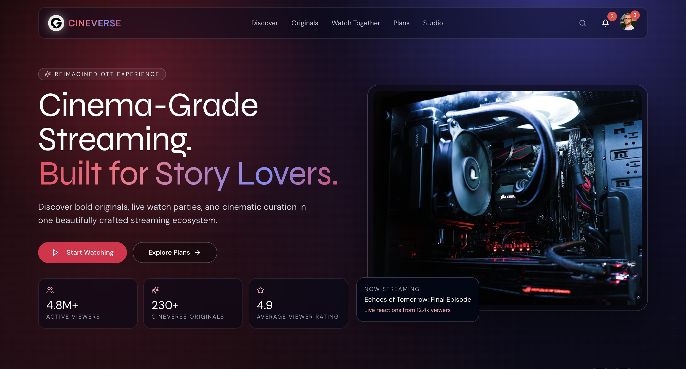
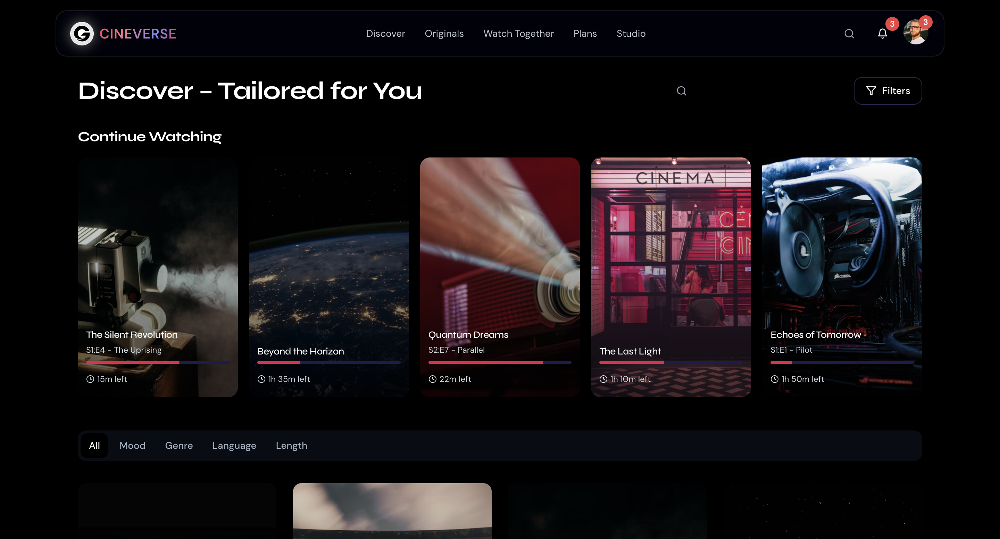

# CINEVERSE OTT Platform

A premium, cinematic OTT frontend built with **Next.js 15**, **React 19**, **TypeScript**, and **Tailwind CSS**.

This project focuses on a polished end-to-end frontend experience: responsive layouts, immersive visuals, modern UI interactions, and reusable component architecture.

## Live App Sections

- `/` - Home (hero, carousels, highlights)
- `/discover` - Discovery experience with filters, tabs, and continue watching
- `/originals` - Originals showcase and featured content
- `/watch-together` - Social/watch-party style experience
- `/plans` - Pricing plans and device compatibility
- `/studio` - Brand/creator storytelling section

## Tech Stack

- Next.js 15 (App Router)
- React 19
- TypeScript
- Tailwind CSS
- Radix UI primitives
- Lucide Icons
- Vercel Analytics

## Getting Started

### 1. Install dependencies

```bash
npm install
```

### 2. Run development server

```bash
npm run dev
```

Open [http://localhost:3000](http://localhost:3000)

### 3. Build for production

```bash
npm run build
```

### 4. Start production server

```bash
npm run start
```

## Scripts

- `npm run dev` - Start local development server
- `npm run build` - Create production build
- `npm run start` - Run production server
- `npm run lint` - Run linting (requires eslint binary available in environment)

## Project Structure

```text
app/                 # App Router pages and route-level files
components/          # Reusable app components
components/ui/       # Shared UI primitives
hooks/               # Custom React hooks
lib/                 # Utility functions
public/              # Static assets (logo, icons, screenshot, etc.)
```

## Design Notes

- Mobile-first responsive behavior across all major routes
- Cinematic dark visual system with gradients and layered depth
- Reusable UI patterns for cards, tabs, menus, and overlays
- Accessibility-oriented interaction states (focus, hover, contrast improvements)

## Assets

Primary brand and visuals are stored in `public/`.
The README cover screenshot is sourced from:

- `public/appScreenshot.png`

---

If you want, I can also add contribution guidelines and deployment steps (Vercel) in this README.
